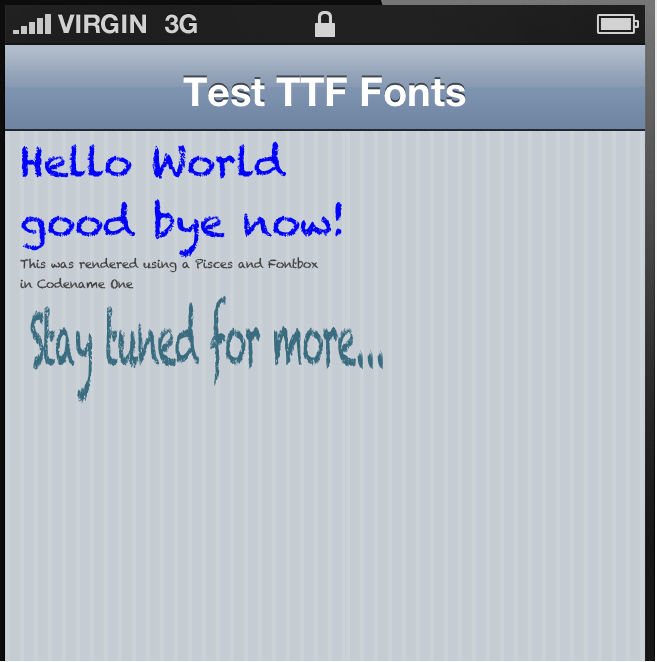

#Codename One FontBox Port

This is a port of the [FontBox](http://sourceforge.net/projects/fontbox/) library for use with [Codename One](http://www.codenameone.com)'s [CN1Pisces](https://github.com/shannah/CN1Pisces) graphics library.

This library adds the ability to load and render TTF fonts as scalable vectors on a Pisces 2D drawing surface like [pisces.Graphics](https://rawgithub.com/shannah/CN1Pisces/master/dist/javadoc/pisces/Graphics.html).

##Features

1. Support for TTF Fonts
2. Library additionally can support CFF, AFM. and PFB fonts but these haven't been specifically integrated into Codename One.
3. Obtain font metrics, and glyph shapes as vector paths.
4. Fonts can be used with AffineTransforms (scale, shear, rotate, translation) to draw text in any size and orientation.

##Compatibility

This library should be compatible with all platforms that Codename One runs on.  So far I have only tested it on the Simulator, iOS, and Android, but it should work on all platforms.

##License

Apache License 2.0

##Dependencies

1. The [CN1Pisces](https://github.com/shannah/CN1Pisces) library.

##Installation Instructions

Assuming you have a Codename One application project started in Netbeans:

1. Add the [CN1Pisces](https://github.com/shannah/CN1Pisces) library to your project.
2. Copy [CN1FontBox.cn1lib](https://github.com/shannah/CN1FontBox/raw/master/dist/CN1FontBox.cn1lib) into your project's `lib` directory.  Then right click on your project's icon in the project explorer, and select "Refresh Libs" from the contextual menu.

##Usage Example

~~~
// Get the default font provider.
FontBoxFontProvider fontProvider = FontBoxFontProvider.getDefaultProvider();

// Load a TTF File that we included in the root of our app's source 
// directory.            
InputStream is = Display.getInstance().getResourceAsStream(null, "/Chalkduster.ttf");

// Load the font under the name "Chalkduster"
fontProvider.loadTTF("Chalkduster", is);

// Register the FontBox font provider with Pisces
Font.addProvider(fontProvider);

// Create a Pisces rendering context
pisces.Graphics g = new pisces.Graphics(400,400);

// Set transform and color for text
g.setTransform(new Matrix().setIdentity());
g.setColor(pisces.Color.Blue);

// Get font in size 40 (pixels high)
pisces.Font pfont = Font.getFont("Chalkduster", 40);
g.setFont(pfont);

// Draw some text            
g.draw("Hello World", 10,0, 40);
g.draw("good bye now!", 10, 60, 40);

// Get the font in size 12
pisces.Font pfont2 = pfont.deriveFont(12);
g.setFont(pfont2);
g.setColor(pisces.Color.DarkGray);

// Draw some more text
g.draw("This was rendered using a Pisces and Fontbox ", 10, 120);
g.draw("in Codename One ", 10, 140);

pisces.Color c = new pisces.Color(255, 58, 108, 128);
g.setColor(c);

// Keep font size same, but use affine transform to scale the text
// We'll make it 2.5x wider and 6x taller            
float scaleX = 2.5f;
float scaleY = 6.0f;
g.setTransform(Matrix.getScaleInstance(scaleX, scaleY));

g.draw("Stay tuned for more...", (int)(20f/scaleX), (int)(160f/scaleY));

// Now export Pisces context as an Image and add it to the form
Image img = g.toImage();
Label lbl = new Label(img);
theForm.addComponent(lbl);
~~~

The output of this code would be something like:

##Documentation

1. [JavaDocs](https://rawgithub.com/shannah/CN1FontBox/blob/master/dist/javadoc/index.html)
